# Conexión con la API del COVID-19 y análisis con Pandas

Me conecto a la API https://api.covid19api.com/

# Instalación de librerías


```python
!pip install pandas
```

    Requirement already satisfied: pandas in c:\users\fanny\documents\python scripts\lib\site-packages (1.4.2)
    Requirement already satisfied: python-dateutil>=2.8.1 in c:\users\fanny\documents\python scripts\lib\site-packages (from pandas) (2.8.2)
    Requirement already satisfied: pytz>=2020.1 in c:\users\fanny\documents\python scripts\lib\site-packages (from pandas) (2021.3)
    Requirement already satisfied: numpy>=1.18.5 in c:\users\fanny\documents\python scripts\lib\site-packages (from pandas) (1.21.5)
    Requirement already satisfied: six>=1.5 in c:\users\fanny\documents\python scripts\lib\site-packages (from python-dateutil>=2.8.1->pandas) (1.16.0)
    

# Configuración de Pandas


```python
import pandas as pd
```

# Crear variable 
Definimos una variable que tiene este valor https://api.covid19api.com/countries


```python
url = 'https://api.covid19api.com/countries'
```


```python
url
```


    'https://api.covid19api.com/countries'


# Crear dataframe
Vamos a crear un dataframe con la función de panda.  
Voy a definir un dataframe que es como se llama la estrutura de tablas/datos en Phyton y usaré la funcion de _pd.read_json_
Si lo invoco me sale el json en formato de tabla.


```python
df = pd.read_json(url)
```


```python
df
```


<div>
<style scoped>
    .dataframe tbody tr th:only-of-type {
        vertical-align: middle;
    }

    .dataframe tbody tr th {
        vertical-align: top;
    }

    .dataframe thead th {
        text-align: right;
    }
</style>
<table border="1" class="dataframe">
  <thead>
    <tr style="text-align: right;">
      <th></th>
      <th>Country</th>
      <th>Slug</th>
      <th>ISO2</th>
    </tr>
  </thead>
  <tbody>
    <tr>
      <th>0</th>
      <td>Gibraltar</td>
      <td>gibraltar</td>
      <td>GI</td>
    </tr>
    <tr>
      <th>1</th>
      <td>Oman</td>
      <td>oman</td>
      <td>OM</td>
    </tr>
    <tr>
      <th>2</th>
      <td>France</td>
      <td>france</td>
      <td>FR</td>
    </tr>
    <tr>
      <th>3</th>
      <td>Jersey</td>
      <td>jersey</td>
      <td>JE</td>
    </tr>
    <tr>
      <th>4</th>
      <td>Mali</td>
      <td>mali</td>
      <td>ML</td>
    </tr>
    <tr>
      <th>...</th>
      <td>...</td>
      <td>...</td>
      <td>...</td>
    </tr>
    <tr>
      <th>243</th>
      <td>Puerto Rico</td>
      <td>puerto-rico</td>
      <td>PR</td>
    </tr>
    <tr>
      <th>244</th>
      <td>Papua New Guinea</td>
      <td>papua-new-guinea</td>
      <td>PG</td>
    </tr>
    <tr>
      <th>245</th>
      <td>Saint Pierre and Miquelon</td>
      <td>saint-pierre-and-miquelon</td>
      <td>PM</td>
    </tr>
    <tr>
      <th>246</th>
      <td>Timor-Leste</td>
      <td>timor-leste</td>
      <td>TL</td>
    </tr>
    <tr>
      <th>247</th>
      <td>Montenegro</td>
      <td>montenegro</td>
      <td>ME</td>
    </tr>
  </tbody>
</table>
<p>248 rows × 3 columns</p>
</div>


## España

Ya tengo el dataframe, pero para que salgan los datos de **España** (en este caso en inglés, Spain) qué vamos hacer. Como tengo una columna que se llama **Country**, creo una lista nueva donde le digo a esa lista que el país que voy a seleccionar es ==, tiene que ser Spain.


```python
df[df['Country'] == 'Spain']
```


<div>
<style scoped>
    .dataframe tbody tr th:only-of-type {
        vertical-align: middle;
    }

    .dataframe tbody tr th {
        vertical-align: top;
    }

    .dataframe thead th {
        text-align: right;
    }
</style>
<table border="1" class="dataframe">
  <thead>
    <tr style="text-align: right;">
      <th></th>
      <th>Country</th>
      <th>Slug</th>
      <th>ISO2</th>
    </tr>
  </thead>
  <tbody>
    <tr>
      <th>141</th>
      <td>Spain</td>
      <td>spain</td>
      <td>ES</td>
    </tr>
  </tbody>
</table>
</div>


#### Casos España en tiempo real

Se buscaron los casos de España (Spain) en tiempo real. Creo la url que se llama **rt**, que viene de real time, y además se va a llamar **url_rt_es**, real time de España (Spain). 
En la primera línea defino la url que son los casos confirmados en este país. Luego defino el objeto **df_rt_es**, el cual es el encargado de leer la información de la url. 


```python
url_rt_es = 'https://api.covid19api.com/country/spain/status/confirmed/live'
df_rt_es = pd.read_json(url_rt_es)
df_rt_es
```


<div>
<style scoped>
    .dataframe tbody tr th:only-of-type {
        vertical-align: middle;
    }

    .dataframe tbody tr th {
        vertical-align: top;
    }

    .dataframe thead th {
        text-align: right;
    }
</style>
<table border="1" class="dataframe">
  <thead>
    <tr style="text-align: right;">
      <th></th>
      <th>Country</th>
      <th>CountryCode</th>
      <th>Province</th>
      <th>City</th>
      <th>CityCode</th>
      <th>Lat</th>
      <th>Lon</th>
      <th>Cases</th>
      <th>Status</th>
      <th>Date</th>
    </tr>
  </thead>
  <tbody>
    <tr>
      <th>0</th>
      <td>Spain</td>
      <td>ES</td>
      <td></td>
      <td></td>
      <td></td>
      <td>40.46</td>
      <td>-3.75</td>
      <td>0</td>
      <td>confirmed</td>
      <td>2020-01-22 00:00:00+00:00</td>
    </tr>
    <tr>
      <th>1</th>
      <td>Spain</td>
      <td>ES</td>
      <td></td>
      <td></td>
      <td></td>
      <td>40.46</td>
      <td>-3.75</td>
      <td>0</td>
      <td>confirmed</td>
      <td>2020-01-23 00:00:00+00:00</td>
    </tr>
    <tr>
      <th>2</th>
      <td>Spain</td>
      <td>ES</td>
      <td></td>
      <td></td>
      <td></td>
      <td>40.46</td>
      <td>-3.75</td>
      <td>0</td>
      <td>confirmed</td>
      <td>2020-01-24 00:00:00+00:00</td>
    </tr>
    <tr>
      <th>3</th>
      <td>Spain</td>
      <td>ES</td>
      <td></td>
      <td></td>
      <td></td>
      <td>40.46</td>
      <td>-3.75</td>
      <td>0</td>
      <td>confirmed</td>
      <td>2020-01-25 00:00:00+00:00</td>
    </tr>
    <tr>
      <th>4</th>
      <td>Spain</td>
      <td>ES</td>
      <td></td>
      <td></td>
      <td></td>
      <td>40.46</td>
      <td>-3.75</td>
      <td>0</td>
      <td>confirmed</td>
      <td>2020-01-26 00:00:00+00:00</td>
    </tr>
    <tr>
      <th>...</th>
      <td>...</td>
      <td>...</td>
      <td>...</td>
      <td>...</td>
      <td>...</td>
      <td>...</td>
      <td>...</td>
      <td>...</td>
      <td>...</td>
      <td>...</td>
    </tr>
    <tr>
      <th>892</th>
      <td>Spain</td>
      <td>ES</td>
      <td></td>
      <td></td>
      <td></td>
      <td>40.46</td>
      <td>-3.75</td>
      <td>12818184</td>
      <td>confirmed</td>
      <td>2022-07-02 00:00:00+00:00</td>
    </tr>
    <tr>
      <th>893</th>
      <td>Spain</td>
      <td>ES</td>
      <td></td>
      <td></td>
      <td></td>
      <td>40.46</td>
      <td>-3.75</td>
      <td>12818184</td>
      <td>confirmed</td>
      <td>2022-07-03 00:00:00+00:00</td>
    </tr>
    <tr>
      <th>894</th>
      <td>Spain</td>
      <td>ES</td>
      <td></td>
      <td></td>
      <td></td>
      <td>40.46</td>
      <td>-3.75</td>
      <td>12818184</td>
      <td>confirmed</td>
      <td>2022-07-04 00:00:00+00:00</td>
    </tr>
    <tr>
      <th>895</th>
      <td>Spain</td>
      <td>ES</td>
      <td></td>
      <td></td>
      <td></td>
      <td>40.46</td>
      <td>-3.75</td>
      <td>12890002</td>
      <td>confirmed</td>
      <td>2022-07-05 00:00:00+00:00</td>
    </tr>
    <tr>
      <th>896</th>
      <td>Spain</td>
      <td>ES</td>
      <td></td>
      <td></td>
      <td></td>
      <td>40.46</td>
      <td>-3.75</td>
      <td>12890002</td>
      <td>confirmed</td>
      <td>2022-07-06 00:00:00+00:00</td>
    </tr>
  </tbody>
</table>
<p>897 rows × 10 columns</p>
</div>


Si marco la función df_rt_es.head() me permite ver la **parte inicial de la tabla**, como aprecia a continuación.


```python
df_rt_es.head()
```


<div>
<style scoped>
    .dataframe tbody tr th:only-of-type {
        vertical-align: middle;
    }

    .dataframe tbody tr th {
        vertical-align: top;
    }

    .dataframe thead th {
        text-align: right;
    }
</style>
<table border="1" class="dataframe">
  <thead>
    <tr style="text-align: right;">
      <th></th>
      <th>Country</th>
      <th>CountryCode</th>
      <th>Province</th>
      <th>City</th>
      <th>CityCode</th>
      <th>Lat</th>
      <th>Lon</th>
      <th>Cases</th>
      <th>Status</th>
      <th>Date</th>
    </tr>
  </thead>
  <tbody>
    <tr>
      <th>0</th>
      <td>Spain</td>
      <td>ES</td>
      <td></td>
      <td></td>
      <td></td>
      <td>40.46</td>
      <td>-3.75</td>
      <td>0</td>
      <td>confirmed</td>
      <td>2020-01-22 00:00:00+00:00</td>
    </tr>
    <tr>
      <th>1</th>
      <td>Spain</td>
      <td>ES</td>
      <td></td>
      <td></td>
      <td></td>
      <td>40.46</td>
      <td>-3.75</td>
      <td>0</td>
      <td>confirmed</td>
      <td>2020-01-23 00:00:00+00:00</td>
    </tr>
    <tr>
      <th>2</th>
      <td>Spain</td>
      <td>ES</td>
      <td></td>
      <td></td>
      <td></td>
      <td>40.46</td>
      <td>-3.75</td>
      <td>0</td>
      <td>confirmed</td>
      <td>2020-01-24 00:00:00+00:00</td>
    </tr>
    <tr>
      <th>3</th>
      <td>Spain</td>
      <td>ES</td>
      <td></td>
      <td></td>
      <td></td>
      <td>40.46</td>
      <td>-3.75</td>
      <td>0</td>
      <td>confirmed</td>
      <td>2020-01-25 00:00:00+00:00</td>
    </tr>
    <tr>
      <th>4</th>
      <td>Spain</td>
      <td>ES</td>
      <td></td>
      <td></td>
      <td></td>
      <td>40.46</td>
      <td>-3.75</td>
      <td>0</td>
      <td>confirmed</td>
      <td>2020-01-26 00:00:00+00:00</td>
    </tr>
  </tbody>
</table>
</div>


Con la función df_rt_es.tail() podemos ver la **cola de la tabla**. Procedo a marcarla. 


```python
df_rt_es.tail()
```


<div>
<style scoped>
    .dataframe tbody tr th:only-of-type {
        vertical-align: middle;
    }

    .dataframe tbody tr th {
        vertical-align: top;
    }

    .dataframe thead th {
        text-align: right;
    }
</style>
<table border="1" class="dataframe">
  <thead>
    <tr style="text-align: right;">
      <th></th>
      <th>Country</th>
      <th>CountryCode</th>
      <th>Province</th>
      <th>City</th>
      <th>CityCode</th>
      <th>Lat</th>
      <th>Lon</th>
      <th>Cases</th>
      <th>Status</th>
      <th>Date</th>
    </tr>
  </thead>
  <tbody>
    <tr>
      <th>892</th>
      <td>Spain</td>
      <td>ES</td>
      <td></td>
      <td></td>
      <td></td>
      <td>40.46</td>
      <td>-3.75</td>
      <td>12818184</td>
      <td>confirmed</td>
      <td>2022-07-02 00:00:00+00:00</td>
    </tr>
    <tr>
      <th>893</th>
      <td>Spain</td>
      <td>ES</td>
      <td></td>
      <td></td>
      <td></td>
      <td>40.46</td>
      <td>-3.75</td>
      <td>12818184</td>
      <td>confirmed</td>
      <td>2022-07-03 00:00:00+00:00</td>
    </tr>
    <tr>
      <th>894</th>
      <td>Spain</td>
      <td>ES</td>
      <td></td>
      <td></td>
      <td></td>
      <td>40.46</td>
      <td>-3.75</td>
      <td>12818184</td>
      <td>confirmed</td>
      <td>2022-07-04 00:00:00+00:00</td>
    </tr>
    <tr>
      <th>895</th>
      <td>Spain</td>
      <td>ES</td>
      <td></td>
      <td></td>
      <td></td>
      <td>40.46</td>
      <td>-3.75</td>
      <td>12890002</td>
      <td>confirmed</td>
      <td>2022-07-05 00:00:00+00:00</td>
    </tr>
    <tr>
      <th>896</th>
      <td>Spain</td>
      <td>ES</td>
      <td></td>
      <td></td>
      <td></td>
      <td>40.46</td>
      <td>-3.75</td>
      <td>12890002</td>
      <td>confirmed</td>
      <td>2022-07-06 00:00:00+00:00</td>
    </tr>
  </tbody>
</table>
</div>


#### Casos de España con sus fechas

Para poder apreciar una gráfica de España con el **número de casos y sus respectivas fechas** debo convertir la columna de fecha en columna de control, solicitando que se muestren los datos de los casos desde el 20 de enero de 2020 hasta la fecha en la que hice esta actividad, por esta razón marcamos la función que se muestra a continuación, pero utlizando un nombre de variable plot_rt_es. 


```python
plot_rt_es = df_rt_es.set_index('Date')['Cases'].plot(title="Casos de Covid19 en España desde 20/1/2020 hasta 29/6/2022")
```


    
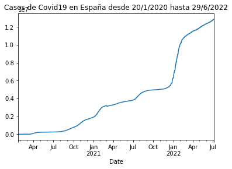
    


# Datos de Panamá
Repetimos el proceso, usamos el mismo código de variable, pero en este caso con la *url de Panamá*.


```python
df[df['Country'] == 'Panama']
```


<div>
<style scoped>
    .dataframe tbody tr th:only-of-type {
        vertical-align: middle;
    }

    .dataframe tbody tr th {
        vertical-align: top;
    }

    .dataframe thead th {
        text-align: right;
    }
</style>
<table border="1" class="dataframe">
  <thead>
    <tr style="text-align: right;">
      <th></th>
      <th>Country</th>
      <th>Slug</th>
      <th>ISO2</th>
    </tr>
  </thead>
  <tbody>
    <tr>
      <th>190</th>
      <td>Panama</td>
      <td>panama</td>
      <td>PA</td>
    </tr>
  </tbody>
</table>
</div>


```python
df[df['Country'] == 'Panama']
```


<div>
<style scoped>
    .dataframe tbody tr th:only-of-type {
        vertical-align: middle;
    }

    .dataframe tbody tr th {
        vertical-align: top;
    }

    .dataframe thead th {
        text-align: right;
    }
</style>
<table border="1" class="dataframe">
  <thead>
    <tr style="text-align: right;">
      <th></th>
      <th>Country</th>
      <th>Slug</th>
      <th>ISO2</th>
    </tr>
  </thead>
  <tbody>
    <tr>
      <th>190</th>
      <td>Panama</td>
      <td>panama</td>
      <td>PA</td>
    </tr>
  </tbody>
</table>
</div>


Definimos una variable **url_rt_pa**
La url de Panamá tiene un **json**.
Quiero crear un objeto, en este caso una tabla y el valor de esta tabla es el que sale del resultado del usar la función de pandas **read.json** sobre la url que he definido anteriormente.
En la tercera celda a jupyter muestra esta variable **df_rt_pa**


```python
url_rt_pa = 'https://api.covid19api.com/country/panama/status/confirmed/live'
df_rt_pa = pd.read_json(url_rt_pa)
df_rt_pa
```


<div>
<style scoped>
    .dataframe tbody tr th:only-of-type {
        vertical-align: middle;
    }

    .dataframe tbody tr th {
        vertical-align: top;
    }

    .dataframe thead th {
        text-align: right;
    }
</style>
<table border="1" class="dataframe">
  <thead>
    <tr style="text-align: right;">
      <th></th>
      <th>Country</th>
      <th>CountryCode</th>
      <th>Province</th>
      <th>City</th>
      <th>CityCode</th>
      <th>Lat</th>
      <th>Lon</th>
      <th>Cases</th>
      <th>Status</th>
      <th>Date</th>
    </tr>
  </thead>
  <tbody>
    <tr>
      <th>0</th>
      <td>Panama</td>
      <td>PA</td>
      <td></td>
      <td></td>
      <td></td>
      <td>8.54</td>
      <td>-80.78</td>
      <td>0</td>
      <td>confirmed</td>
      <td>2020-01-22 00:00:00+00:00</td>
    </tr>
    <tr>
      <th>1</th>
      <td>Panama</td>
      <td>PA</td>
      <td></td>
      <td></td>
      <td></td>
      <td>8.54</td>
      <td>-80.78</td>
      <td>0</td>
      <td>confirmed</td>
      <td>2020-01-23 00:00:00+00:00</td>
    </tr>
    <tr>
      <th>2</th>
      <td>Panama</td>
      <td>PA</td>
      <td></td>
      <td></td>
      <td></td>
      <td>8.54</td>
      <td>-80.78</td>
      <td>0</td>
      <td>confirmed</td>
      <td>2020-01-24 00:00:00+00:00</td>
    </tr>
    <tr>
      <th>3</th>
      <td>Panama</td>
      <td>PA</td>
      <td></td>
      <td></td>
      <td></td>
      <td>8.54</td>
      <td>-80.78</td>
      <td>0</td>
      <td>confirmed</td>
      <td>2020-01-25 00:00:00+00:00</td>
    </tr>
    <tr>
      <th>4</th>
      <td>Panama</td>
      <td>PA</td>
      <td></td>
      <td></td>
      <td></td>
      <td>8.54</td>
      <td>-80.78</td>
      <td>0</td>
      <td>confirmed</td>
      <td>2020-01-26 00:00:00+00:00</td>
    </tr>
    <tr>
      <th>...</th>
      <td>...</td>
      <td>...</td>
      <td>...</td>
      <td>...</td>
      <td>...</td>
      <td>...</td>
      <td>...</td>
      <td>...</td>
      <td>...</td>
      <td>...</td>
    </tr>
    <tr>
      <th>893</th>
      <td>Panama</td>
      <td>PA</td>
      <td></td>
      <td></td>
      <td></td>
      <td>8.54</td>
      <td>-80.78</td>
      <td>925254</td>
      <td>confirmed</td>
      <td>2022-07-03 00:00:00+00:00</td>
    </tr>
    <tr>
      <th>894</th>
      <td>Panama</td>
      <td>PA</td>
      <td></td>
      <td></td>
      <td></td>
      <td>8.54</td>
      <td>-80.78</td>
      <td>925254</td>
      <td>confirmed</td>
      <td>2022-07-04 00:00:00+00:00</td>
    </tr>
    <tr>
      <th>895</th>
      <td>Panama</td>
      <td>PA</td>
      <td></td>
      <td></td>
      <td></td>
      <td>8.54</td>
      <td>-80.78</td>
      <td>925254</td>
      <td>confirmed</td>
      <td>2022-07-05 00:00:00+00:00</td>
    </tr>
    <tr>
      <th>896</th>
      <td>Panama</td>
      <td>PA</td>
      <td></td>
      <td></td>
      <td></td>
      <td>8.54</td>
      <td>-80.78</td>
      <td>925254</td>
      <td>confirmed</td>
      <td>2022-07-06 00:00:00+00:00</td>
    </tr>
    <tr>
      <th>897</th>
      <td>Panama</td>
      <td>PA</td>
      <td></td>
      <td></td>
      <td></td>
      <td>8.54</td>
      <td>-80.78</td>
      <td>925254</td>
      <td>confirmed</td>
      <td>2022-07-08 00:00:00+00:00</td>
    </tr>
  </tbody>
</table>
<p>898 rows × 10 columns</p>
</div>


Tal como hice con España, en este caso para poder ver una gráfica de Panamá con el **número de casos y sus respectivas fechas** debo convertir la columna de fecha en columna de control, solicitando que se muestren los datos de los casos desde el 20 de enero de 2020 hasta la fecha en la que hice esta actividad, por esta razón marcamos la función que se muestra a continuación, pero utlizando un nombre de variable plot_rt_pa. 


```python
plot_rt_pa = df_rt_pa.set_index('Date')['Cases'].plot(title="Casos de Covid-19 en Panamá desde 20/01/2020 hasta 29/06/2022")
```


    
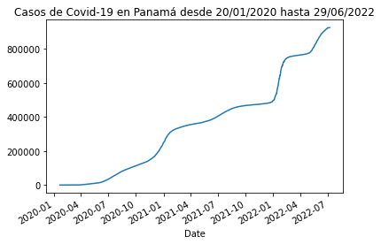
    


Para la gráfica que se visualiza a continuación añadí **,kind="area"** para un gráfico de área. 


```python
plot_rt_pa = df_rt_pa.set_index('Date')['Cases'].plot(title="Casos de Covid-19 en Panamá desde 20/01/2020 hasta 29/06/2022",kind="area")
```


    
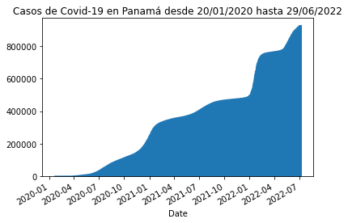
    


Para lograr la gráfica que se ve a continuación usé la función **,kind="bar"** así se logrará ver una gráfica de barras. 


```python
plot_rt_pa = df_rt_pa.set_index('Date')['Cases'].plot(title="Casos de Covid-19 en Panamá desde 20/01/2020 hasta 29/06/2022",kind="bar")
```


    
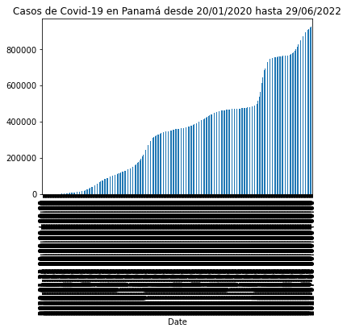
    


# Ploteamos dos países
Para realizar esta acción hay que **identificar nuevamente las variables previas** de json de las dos url, así no será necesario repetir el proceso.


```python
df_rt_pa = pd.read_json(url_rt_pa)
df_rt_es = pd.read_json(url_rt_es)
```

Debemos plotear para poder ver la gráfica. En cada país los casos se van a separar por fechas. 


```python
casos_pa = df_rt_pa.set_index('Date')['Cases']
casos_pa.plot(title="Casos de Covid-19 en Panamá")
```


    <AxesSubplot:title={'center':'Casos de Covid-19 en Panamá'}, xlabel='Date'>


    

    


```python
casos_es = df_rt_es.set_index('Date')['Cases']
casos_pa.plot(title="Casos de Covid-19 en España")
```


    <AxesSubplot:title={'center':'Casos de Covid-19 en España'}, xlabel='Date'>


    
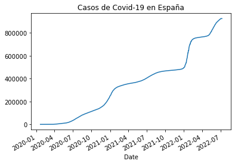
    


Si queremos **visualizar** podemos concatenar ambas tablas con los datos que hemos visto hasta el momento.


```python
pa_vs_es = pd.concat([casos_es,casos_pa],axis=1)
pa_vs_es
```


<div>
<style scoped>
    .dataframe tbody tr th:only-of-type {
        vertical-align: middle;
    }

    .dataframe tbody tr th {
        vertical-align: top;
    }

    .dataframe thead th {
        text-align: right;
    }
</style>
<table border="1" class="dataframe">
  <thead>
    <tr style="text-align: right;">
      <th></th>
      <th>Cases</th>
      <th>Cases</th>
    </tr>
    <tr>
      <th>Date</th>
      <th></th>
      <th></th>
    </tr>
  </thead>
  <tbody>
    <tr>
      <th>2020-01-22 00:00:00+00:00</th>
      <td>0.0</td>
      <td>0</td>
    </tr>
    <tr>
      <th>2020-01-23 00:00:00+00:00</th>
      <td>0.0</td>
      <td>0</td>
    </tr>
    <tr>
      <th>2020-01-24 00:00:00+00:00</th>
      <td>0.0</td>
      <td>0</td>
    </tr>
    <tr>
      <th>2020-01-25 00:00:00+00:00</th>
      <td>0.0</td>
      <td>0</td>
    </tr>
    <tr>
      <th>2020-01-26 00:00:00+00:00</th>
      <td>0.0</td>
      <td>0</td>
    </tr>
    <tr>
      <th>...</th>
      <td>...</td>
      <td>...</td>
    </tr>
    <tr>
      <th>2022-07-03 00:00:00+00:00</th>
      <td>12818184.0</td>
      <td>925254</td>
    </tr>
    <tr>
      <th>2022-07-04 00:00:00+00:00</th>
      <td>12818184.0</td>
      <td>925254</td>
    </tr>
    <tr>
      <th>2022-07-05 00:00:00+00:00</th>
      <td>12890002.0</td>
      <td>925254</td>
    </tr>
    <tr>
      <th>2022-07-06 00:00:00+00:00</th>
      <td>12890002.0</td>
      <td>925254</td>
    </tr>
    <tr>
      <th>2022-07-08 00:00:00+00:00</th>
      <td>NaN</td>
      <td>925254</td>
    </tr>
  </tbody>
</table>
<p>898 rows × 2 columns</p>
</div>


Continuando con este **ejercicio de programación literaria**, podemos decir que para reconocer los países se debe marcar las columnas con el nombre y de esta manera podemos ver la gráfica con los datos nombrados.


```python
pa_vs_es.columns= ['España','Panamá']
pa_vs_es
```


<div>
<style scoped>
    .dataframe tbody tr th:only-of-type {
        vertical-align: middle;
    }

    .dataframe tbody tr th {
        vertical-align: top;
    }

    .dataframe thead th {
        text-align: right;
    }
</style>
<table border="1" class="dataframe">
  <thead>
    <tr style="text-align: right;">
      <th></th>
      <th>España</th>
      <th>Panamá</th>
    </tr>
    <tr>
      <th>Date</th>
      <th></th>
      <th></th>
    </tr>
  </thead>
  <tbody>
    <tr>
      <th>2020-01-22 00:00:00+00:00</th>
      <td>0.0</td>
      <td>0</td>
    </tr>
    <tr>
      <th>2020-01-23 00:00:00+00:00</th>
      <td>0.0</td>
      <td>0</td>
    </tr>
    <tr>
      <th>2020-01-24 00:00:00+00:00</th>
      <td>0.0</td>
      <td>0</td>
    </tr>
    <tr>
      <th>2020-01-25 00:00:00+00:00</th>
      <td>0.0</td>
      <td>0</td>
    </tr>
    <tr>
      <th>2020-01-26 00:00:00+00:00</th>
      <td>0.0</td>
      <td>0</td>
    </tr>
    <tr>
      <th>...</th>
      <td>...</td>
      <td>...</td>
    </tr>
    <tr>
      <th>2022-07-03 00:00:00+00:00</th>
      <td>12818184.0</td>
      <td>925254</td>
    </tr>
    <tr>
      <th>2022-07-04 00:00:00+00:00</th>
      <td>12818184.0</td>
      <td>925254</td>
    </tr>
    <tr>
      <th>2022-07-05 00:00:00+00:00</th>
      <td>12890002.0</td>
      <td>925254</td>
    </tr>
    <tr>
      <th>2022-07-06 00:00:00+00:00</th>
      <td>12890002.0</td>
      <td>925254</td>
    </tr>
    <tr>
      <th>2022-07-08 00:00:00+00:00</th>
      <td>NaN</td>
      <td>925254</td>
    </tr>
  </tbody>
</table>
<p>898 rows × 2 columns</p>
</div>


#### Comparación Panamá vs España

Ahora veremos la _comparación de ambos países_ en una gráfica y para lograr esto debemos plotear. 


```python
pa_vs_es.plot(title="Comparativa Covid-19 España-Panamá")
```


    <AxesSubplot:title={'center':'Comparativa Covid-19 España-Panamá'}, xlabel='Date'>


    
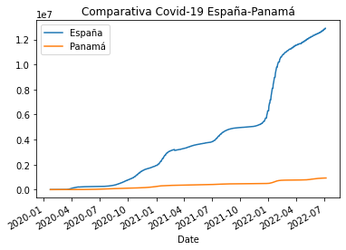
    


# Ahora haré una comparativa de los países de Centroamérica

Tal como se lee en la indicación de la actividad hay que realizar una comparación entre los siguientes países: 
1. Panamá
2. Costa Rica
3. Nicaragua
4. Guatemala
5. El Salvador
6. Honduras

Para esta acción lo primero que haré es **verificar** el slug y el ISO2 para emplear en la URL. Esto se hará en cada uno de los países mencionados. 


```python
df[df['Country'] == 'Panama']
```


<div>
<style scoped>
    .dataframe tbody tr th:only-of-type {
        vertical-align: middle;
    }

    .dataframe tbody tr th {
        vertical-align: top;
    }

    .dataframe thead th {
        text-align: right;
    }
</style>
<table border="1" class="dataframe">
  <thead>
    <tr style="text-align: right;">
      <th></th>
      <th>Country</th>
      <th>Slug</th>
      <th>ISO2</th>
    </tr>
  </thead>
  <tbody>
    <tr>
      <th>190</th>
      <td>Panama</td>
      <td>panama</td>
      <td>PA</td>
    </tr>
  </tbody>
</table>
</div>


```python
df[df['Country'] == 'Costa Rica']
```


<div>
<style scoped>
    .dataframe tbody tr th:only-of-type {
        vertical-align: middle;
    }

    .dataframe tbody tr th {
        vertical-align: top;
    }

    .dataframe thead th {
        text-align: right;
    }
</style>
<table border="1" class="dataframe">
  <thead>
    <tr style="text-align: right;">
      <th></th>
      <th>Country</th>
      <th>Slug</th>
      <th>ISO2</th>
    </tr>
  </thead>
  <tbody>
    <tr>
      <th>242</th>
      <td>Costa Rica</td>
      <td>costa-rica</td>
      <td>CR</td>
    </tr>
  </tbody>
</table>
</div>


```python
df[df['Country'] == 'Nicaragua']
```


<div>
<style scoped>
    .dataframe tbody tr th:only-of-type {
        vertical-align: middle;
    }

    .dataframe tbody tr th {
        vertical-align: top;
    }

    .dataframe thead th {
        text-align: right;
    }
</style>
<table border="1" class="dataframe">
  <thead>
    <tr style="text-align: right;">
      <th></th>
      <th>Country</th>
      <th>Slug</th>
      <th>ISO2</th>
    </tr>
  </thead>
  <tbody>
    <tr>
      <th>36</th>
      <td>Nicaragua</td>
      <td>nicaragua</td>
      <td>NI</td>
    </tr>
  </tbody>
</table>
</div>


```python
df[df['Country'] == 'Guatemala']
```


<div>
<style scoped>
    .dataframe tbody tr th:only-of-type {
        vertical-align: middle;
    }

    .dataframe tbody tr th {
        vertical-align: top;
    }

    .dataframe thead th {
        text-align: right;
    }
</style>
<table border="1" class="dataframe">
  <thead>
    <tr style="text-align: right;">
      <th></th>
      <th>Country</th>
      <th>Slug</th>
      <th>ISO2</th>
    </tr>
  </thead>
  <tbody>
    <tr>
      <th>239</th>
      <td>Guatemala</td>
      <td>guatemala</td>
      <td>GT</td>
    </tr>
  </tbody>
</table>
</div>


```python
df[df['Country'] == 'El Salvador']
```


<div>
<style scoped>
    .dataframe tbody tr th:only-of-type {
        vertical-align: middle;
    }

    .dataframe tbody tr th {
        vertical-align: top;
    }

    .dataframe thead th {
        text-align: right;
    }
</style>
<table border="1" class="dataframe">
  <thead>
    <tr style="text-align: right;">
      <th></th>
      <th>Country</th>
      <th>Slug</th>
      <th>ISO2</th>
    </tr>
  </thead>
  <tbody>
    <tr>
      <th>139</th>
      <td>El Salvador</td>
      <td>el-salvador</td>
      <td>SV</td>
    </tr>
  </tbody>
</table>
</div>


```python
df[df['Country'] == 'Honduras']

```


<div>
<style scoped>
    .dataframe tbody tr th:only-of-type {
        vertical-align: middle;
    }

    .dataframe tbody tr th {
        vertical-align: top;
    }

    .dataframe thead th {
        text-align: right;
    }
</style>
<table border="1" class="dataframe">
  <thead>
    <tr style="text-align: right;">
      <th></th>
      <th>Country</th>
      <th>Slug</th>
      <th>ISO2</th>
    </tr>
  </thead>
  <tbody>
    <tr>
      <th>91</th>
      <td>Honduras</td>
      <td>honduras</td>
      <td>HN</td>
    </tr>
  </tbody>
</table>
</div>


## ¿Qué haré a continuación?
Lo que corresponde es **definir la variable** con la *url* de cada uno de los países, para entonces hacer la llamada a json para las *url* y así ver las tablas correspondientes a cada uno de los países. 
En el caso de **Panamá** ya lo habíamos hecho al inicio de esta práctica, pero se debe repetir para efectos de este ejercicio. 


```python
url_rt_pa = 'https://api.covid19api.com/country/panama/status/confirmed/live'
df_rt_pa = pd.read_json(url_rt_pa)
df_rt_pa
```


<div>
<style scoped>
    .dataframe tbody tr th:only-of-type {
        vertical-align: middle;
    }

    .dataframe tbody tr th {
        vertical-align: top;
    }

    .dataframe thead th {
        text-align: right;
    }
</style>
<table border="1" class="dataframe">
  <thead>
    <tr style="text-align: right;">
      <th></th>
      <th>Country</th>
      <th>CountryCode</th>
      <th>Province</th>
      <th>City</th>
      <th>CityCode</th>
      <th>Lat</th>
      <th>Lon</th>
      <th>Cases</th>
      <th>Status</th>
      <th>Date</th>
    </tr>
  </thead>
  <tbody>
    <tr>
      <th>0</th>
      <td>Panama</td>
      <td>PA</td>
      <td></td>
      <td></td>
      <td></td>
      <td>8.54</td>
      <td>-80.78</td>
      <td>0</td>
      <td>confirmed</td>
      <td>2020-01-22 00:00:00+00:00</td>
    </tr>
    <tr>
      <th>1</th>
      <td>Panama</td>
      <td>PA</td>
      <td></td>
      <td></td>
      <td></td>
      <td>8.54</td>
      <td>-80.78</td>
      <td>0</td>
      <td>confirmed</td>
      <td>2020-01-23 00:00:00+00:00</td>
    </tr>
    <tr>
      <th>2</th>
      <td>Panama</td>
      <td>PA</td>
      <td></td>
      <td></td>
      <td></td>
      <td>8.54</td>
      <td>-80.78</td>
      <td>0</td>
      <td>confirmed</td>
      <td>2020-01-24 00:00:00+00:00</td>
    </tr>
    <tr>
      <th>3</th>
      <td>Panama</td>
      <td>PA</td>
      <td></td>
      <td></td>
      <td></td>
      <td>8.54</td>
      <td>-80.78</td>
      <td>0</td>
      <td>confirmed</td>
      <td>2020-01-25 00:00:00+00:00</td>
    </tr>
    <tr>
      <th>4</th>
      <td>Panama</td>
      <td>PA</td>
      <td></td>
      <td></td>
      <td></td>
      <td>8.54</td>
      <td>-80.78</td>
      <td>0</td>
      <td>confirmed</td>
      <td>2020-01-26 00:00:00+00:00</td>
    </tr>
    <tr>
      <th>...</th>
      <td>...</td>
      <td>...</td>
      <td>...</td>
      <td>...</td>
      <td>...</td>
      <td>...</td>
      <td>...</td>
      <td>...</td>
      <td>...</td>
      <td>...</td>
    </tr>
    <tr>
      <th>893</th>
      <td>Panama</td>
      <td>PA</td>
      <td></td>
      <td></td>
      <td></td>
      <td>8.54</td>
      <td>-80.78</td>
      <td>925254</td>
      <td>confirmed</td>
      <td>2022-07-03 00:00:00+00:00</td>
    </tr>
    <tr>
      <th>894</th>
      <td>Panama</td>
      <td>PA</td>
      <td></td>
      <td></td>
      <td></td>
      <td>8.54</td>
      <td>-80.78</td>
      <td>925254</td>
      <td>confirmed</td>
      <td>2022-07-04 00:00:00+00:00</td>
    </tr>
    <tr>
      <th>895</th>
      <td>Panama</td>
      <td>PA</td>
      <td></td>
      <td></td>
      <td></td>
      <td>8.54</td>
      <td>-80.78</td>
      <td>925254</td>
      <td>confirmed</td>
      <td>2022-07-05 00:00:00+00:00</td>
    </tr>
    <tr>
      <th>896</th>
      <td>Panama</td>
      <td>PA</td>
      <td></td>
      <td></td>
      <td></td>
      <td>8.54</td>
      <td>-80.78</td>
      <td>925254</td>
      <td>confirmed</td>
      <td>2022-07-06 00:00:00+00:00</td>
    </tr>
    <tr>
      <th>897</th>
      <td>Panama</td>
      <td>PA</td>
      <td></td>
      <td></td>
      <td></td>
      <td>8.54</td>
      <td>-80.78</td>
      <td>925254</td>
      <td>confirmed</td>
      <td>2022-07-08 00:00:00+00:00</td>
    </tr>
  </tbody>
</table>
<p>898 rows × 10 columns</p>
</div>


```python
url_rt_cr = 'https://api.covid19api.com/country/costa-rica/status/confirmed/live'
df_rt_cr = pd.read_json(url_rt_cr)
df_rt_cr
```


<div>
<style scoped>
    .dataframe tbody tr th:only-of-type {
        vertical-align: middle;
    }

    .dataframe tbody tr th {
        vertical-align: top;
    }

    .dataframe thead th {
        text-align: right;
    }
</style>
<table border="1" class="dataframe">
  <thead>
    <tr style="text-align: right;">
      <th></th>
      <th>Country</th>
      <th>CountryCode</th>
      <th>Province</th>
      <th>City</th>
      <th>CityCode</th>
      <th>Lat</th>
      <th>Lon</th>
      <th>Cases</th>
      <th>Status</th>
      <th>Date</th>
    </tr>
  </thead>
  <tbody>
    <tr>
      <th>0</th>
      <td>Costa Rica</td>
      <td>CR</td>
      <td></td>
      <td></td>
      <td></td>
      <td>9.75</td>
      <td>-83.75</td>
      <td>0</td>
      <td>confirmed</td>
      <td>2020-01-22 00:00:00+00:00</td>
    </tr>
    <tr>
      <th>1</th>
      <td>Costa Rica</td>
      <td>CR</td>
      <td></td>
      <td></td>
      <td></td>
      <td>9.75</td>
      <td>-83.75</td>
      <td>0</td>
      <td>confirmed</td>
      <td>2020-01-23 00:00:00+00:00</td>
    </tr>
    <tr>
      <th>2</th>
      <td>Costa Rica</td>
      <td>CR</td>
      <td></td>
      <td></td>
      <td></td>
      <td>9.75</td>
      <td>-83.75</td>
      <td>0</td>
      <td>confirmed</td>
      <td>2020-01-24 00:00:00+00:00</td>
    </tr>
    <tr>
      <th>3</th>
      <td>Costa Rica</td>
      <td>CR</td>
      <td></td>
      <td></td>
      <td></td>
      <td>9.75</td>
      <td>-83.75</td>
      <td>0</td>
      <td>confirmed</td>
      <td>2020-01-25 00:00:00+00:00</td>
    </tr>
    <tr>
      <th>4</th>
      <td>Costa Rica</td>
      <td>CR</td>
      <td></td>
      <td></td>
      <td></td>
      <td>9.75</td>
      <td>-83.75</td>
      <td>0</td>
      <td>confirmed</td>
      <td>2020-01-26 00:00:00+00:00</td>
    </tr>
    <tr>
      <th>...</th>
      <td>...</td>
      <td>...</td>
      <td>...</td>
      <td>...</td>
      <td>...</td>
      <td>...</td>
      <td>...</td>
      <td>...</td>
      <td>...</td>
      <td>...</td>
    </tr>
    <tr>
      <th>893</th>
      <td>Costa Rica</td>
      <td>CR</td>
      <td></td>
      <td></td>
      <td></td>
      <td>9.75</td>
      <td>-83.75</td>
      <td>904934</td>
      <td>confirmed</td>
      <td>2022-07-03 00:00:00+00:00</td>
    </tr>
    <tr>
      <th>894</th>
      <td>Costa Rica</td>
      <td>CR</td>
      <td></td>
      <td></td>
      <td></td>
      <td>9.75</td>
      <td>-83.75</td>
      <td>904934</td>
      <td>confirmed</td>
      <td>2022-07-04 00:00:00+00:00</td>
    </tr>
    <tr>
      <th>895</th>
      <td>Costa Rica</td>
      <td>CR</td>
      <td></td>
      <td></td>
      <td></td>
      <td>9.75</td>
      <td>-83.75</td>
      <td>904934</td>
      <td>confirmed</td>
      <td>2022-07-05 00:00:00+00:00</td>
    </tr>
    <tr>
      <th>896</th>
      <td>Costa Rica</td>
      <td>CR</td>
      <td></td>
      <td></td>
      <td></td>
      <td>9.75</td>
      <td>-83.75</td>
      <td>904934</td>
      <td>confirmed</td>
      <td>2022-07-06 00:00:00+00:00</td>
    </tr>
    <tr>
      <th>897</th>
      <td>Costa Rica</td>
      <td>CR</td>
      <td></td>
      <td></td>
      <td></td>
      <td>9.75</td>
      <td>-83.75</td>
      <td>904934</td>
      <td>confirmed</td>
      <td>2022-07-08 00:00:00+00:00</td>
    </tr>
  </tbody>
</table>
<p>898 rows × 10 columns</p>
</div>


```python
url_rt_ni = 'https://api.covid19api.com/country/nicaragua/status/confirmed/live'
df_rt_ni = pd.read_json(url_rt_ni)
df_rt_ni
```


<div>
<style scoped>
    .dataframe tbody tr th:only-of-type {
        vertical-align: middle;
    }

    .dataframe tbody tr th {
        vertical-align: top;
    }

    .dataframe thead th {
        text-align: right;
    }
</style>
<table border="1" class="dataframe">
  <thead>
    <tr style="text-align: right;">
      <th></th>
      <th>Country</th>
      <th>CountryCode</th>
      <th>Province</th>
      <th>City</th>
      <th>CityCode</th>
      <th>Lat</th>
      <th>Lon</th>
      <th>Cases</th>
      <th>Status</th>
      <th>Date</th>
    </tr>
  </thead>
  <tbody>
    <tr>
      <th>0</th>
      <td>Nicaragua</td>
      <td>NI</td>
      <td></td>
      <td></td>
      <td></td>
      <td>12.87</td>
      <td>-85.21</td>
      <td>0</td>
      <td>confirmed</td>
      <td>2020-01-22 00:00:00+00:00</td>
    </tr>
    <tr>
      <th>1</th>
      <td>Nicaragua</td>
      <td>NI</td>
      <td></td>
      <td></td>
      <td></td>
      <td>12.87</td>
      <td>-85.21</td>
      <td>0</td>
      <td>confirmed</td>
      <td>2020-01-23 00:00:00+00:00</td>
    </tr>
    <tr>
      <th>2</th>
      <td>Nicaragua</td>
      <td>NI</td>
      <td></td>
      <td></td>
      <td></td>
      <td>12.87</td>
      <td>-85.21</td>
      <td>0</td>
      <td>confirmed</td>
      <td>2020-01-24 00:00:00+00:00</td>
    </tr>
    <tr>
      <th>3</th>
      <td>Nicaragua</td>
      <td>NI</td>
      <td></td>
      <td></td>
      <td></td>
      <td>12.87</td>
      <td>-85.21</td>
      <td>0</td>
      <td>confirmed</td>
      <td>2020-01-25 00:00:00+00:00</td>
    </tr>
    <tr>
      <th>4</th>
      <td>Nicaragua</td>
      <td>NI</td>
      <td></td>
      <td></td>
      <td></td>
      <td>12.87</td>
      <td>-85.21</td>
      <td>0</td>
      <td>confirmed</td>
      <td>2020-01-26 00:00:00+00:00</td>
    </tr>
    <tr>
      <th>...</th>
      <td>...</td>
      <td>...</td>
      <td>...</td>
      <td>...</td>
      <td>...</td>
      <td>...</td>
      <td>...</td>
      <td>...</td>
      <td>...</td>
      <td>...</td>
    </tr>
    <tr>
      <th>893</th>
      <td>Nicaragua</td>
      <td>NI</td>
      <td></td>
      <td></td>
      <td></td>
      <td>12.87</td>
      <td>-85.21</td>
      <td>14690</td>
      <td>confirmed</td>
      <td>2022-07-03 00:00:00+00:00</td>
    </tr>
    <tr>
      <th>894</th>
      <td>Nicaragua</td>
      <td>NI</td>
      <td></td>
      <td></td>
      <td></td>
      <td>12.87</td>
      <td>-85.21</td>
      <td>14690</td>
      <td>confirmed</td>
      <td>2022-07-04 00:00:00+00:00</td>
    </tr>
    <tr>
      <th>895</th>
      <td>Nicaragua</td>
      <td>NI</td>
      <td></td>
      <td></td>
      <td></td>
      <td>12.87</td>
      <td>-85.21</td>
      <td>14690</td>
      <td>confirmed</td>
      <td>2022-07-05 00:00:00+00:00</td>
    </tr>
    <tr>
      <th>896</th>
      <td>Nicaragua</td>
      <td>NI</td>
      <td></td>
      <td></td>
      <td></td>
      <td>12.87</td>
      <td>-85.21</td>
      <td>14721</td>
      <td>confirmed</td>
      <td>2022-07-06 00:00:00+00:00</td>
    </tr>
    <tr>
      <th>897</th>
      <td>Nicaragua</td>
      <td>NI</td>
      <td></td>
      <td></td>
      <td></td>
      <td>12.87</td>
      <td>-85.21</td>
      <td>14721</td>
      <td>confirmed</td>
      <td>2022-07-08 00:00:00+00:00</td>
    </tr>
  </tbody>
</table>
<p>898 rows × 10 columns</p>
</div>


```python
url_rt_gt = 'https://api.covid19api.com/country/guatemala/status/confirmed/live'
df_rt_gt = pd.read_json(url_rt_gt)
df_rt_gt
```


<div>
<style scoped>
    .dataframe tbody tr th:only-of-type {
        vertical-align: middle;
    }

    .dataframe tbody tr th {
        vertical-align: top;
    }

    .dataframe thead th {
        text-align: right;
    }
</style>
<table border="1" class="dataframe">
  <thead>
    <tr style="text-align: right;">
      <th></th>
      <th>Country</th>
      <th>CountryCode</th>
      <th>Province</th>
      <th>City</th>
      <th>CityCode</th>
      <th>Lat</th>
      <th>Lon</th>
      <th>Cases</th>
      <th>Status</th>
      <th>Date</th>
    </tr>
  </thead>
  <tbody>
    <tr>
      <th>0</th>
      <td>Guatemala</td>
      <td>GT</td>
      <td></td>
      <td></td>
      <td></td>
      <td>15.78</td>
      <td>-90.23</td>
      <td>0</td>
      <td>confirmed</td>
      <td>2020-01-22 00:00:00+00:00</td>
    </tr>
    <tr>
      <th>1</th>
      <td>Guatemala</td>
      <td>GT</td>
      <td></td>
      <td></td>
      <td></td>
      <td>15.78</td>
      <td>-90.23</td>
      <td>0</td>
      <td>confirmed</td>
      <td>2020-01-23 00:00:00+00:00</td>
    </tr>
    <tr>
      <th>2</th>
      <td>Guatemala</td>
      <td>GT</td>
      <td></td>
      <td></td>
      <td></td>
      <td>15.78</td>
      <td>-90.23</td>
      <td>0</td>
      <td>confirmed</td>
      <td>2020-01-24 00:00:00+00:00</td>
    </tr>
    <tr>
      <th>3</th>
      <td>Guatemala</td>
      <td>GT</td>
      <td></td>
      <td></td>
      <td></td>
      <td>15.78</td>
      <td>-90.23</td>
      <td>0</td>
      <td>confirmed</td>
      <td>2020-01-25 00:00:00+00:00</td>
    </tr>
    <tr>
      <th>4</th>
      <td>Guatemala</td>
      <td>GT</td>
      <td></td>
      <td></td>
      <td></td>
      <td>15.78</td>
      <td>-90.23</td>
      <td>0</td>
      <td>confirmed</td>
      <td>2020-01-26 00:00:00+00:00</td>
    </tr>
    <tr>
      <th>...</th>
      <td>...</td>
      <td>...</td>
      <td>...</td>
      <td>...</td>
      <td>...</td>
      <td>...</td>
      <td>...</td>
      <td>...</td>
      <td>...</td>
      <td>...</td>
    </tr>
    <tr>
      <th>893</th>
      <td>Guatemala</td>
      <td>GT</td>
      <td></td>
      <td></td>
      <td></td>
      <td>15.78</td>
      <td>-90.23</td>
      <td>920294</td>
      <td>confirmed</td>
      <td>2022-07-03 00:00:00+00:00</td>
    </tr>
    <tr>
      <th>894</th>
      <td>Guatemala</td>
      <td>GT</td>
      <td></td>
      <td></td>
      <td></td>
      <td>15.78</td>
      <td>-90.23</td>
      <td>921146</td>
      <td>confirmed</td>
      <td>2022-07-04 00:00:00+00:00</td>
    </tr>
    <tr>
      <th>895</th>
      <td>Guatemala</td>
      <td>GT</td>
      <td></td>
      <td></td>
      <td></td>
      <td>15.78</td>
      <td>-90.23</td>
      <td>922340</td>
      <td>confirmed</td>
      <td>2022-07-05 00:00:00+00:00</td>
    </tr>
    <tr>
      <th>896</th>
      <td>Guatemala</td>
      <td>GT</td>
      <td></td>
      <td></td>
      <td></td>
      <td>15.78</td>
      <td>-90.23</td>
      <td>927473</td>
      <td>confirmed</td>
      <td>2022-07-06 00:00:00+00:00</td>
    </tr>
    <tr>
      <th>897</th>
      <td>Guatemala</td>
      <td>GT</td>
      <td></td>
      <td></td>
      <td></td>
      <td>15.78</td>
      <td>-90.23</td>
      <td>933259</td>
      <td>confirmed</td>
      <td>2022-07-08 00:00:00+00:00</td>
    </tr>
  </tbody>
</table>
<p>898 rows × 10 columns</p>
</div>


```python
url_rt_sv = 'https://api.covid19api.com/country/el-salvador/status/confirmed/live'
df_rt_sv = pd.read_json(url_rt_sv)
df_rt_sv
```


<div>
<style scoped>
    .dataframe tbody tr th:only-of-type {
        vertical-align: middle;
    }

    .dataframe tbody tr th {
        vertical-align: top;
    }

    .dataframe thead th {
        text-align: right;
    }
</style>
<table border="1" class="dataframe">
  <thead>
    <tr style="text-align: right;">
      <th></th>
      <th>Country</th>
      <th>CountryCode</th>
      <th>Province</th>
      <th>City</th>
      <th>CityCode</th>
      <th>Lat</th>
      <th>Lon</th>
      <th>Cases</th>
      <th>Status</th>
      <th>Date</th>
    </tr>
  </thead>
  <tbody>
    <tr>
      <th>0</th>
      <td>El Salvador</td>
      <td>SV</td>
      <td></td>
      <td></td>
      <td></td>
      <td>13.79</td>
      <td>-88.9</td>
      <td>0</td>
      <td>confirmed</td>
      <td>2020-01-22 00:00:00+00:00</td>
    </tr>
    <tr>
      <th>1</th>
      <td>El Salvador</td>
      <td>SV</td>
      <td></td>
      <td></td>
      <td></td>
      <td>13.79</td>
      <td>-88.9</td>
      <td>0</td>
      <td>confirmed</td>
      <td>2020-01-23 00:00:00+00:00</td>
    </tr>
    <tr>
      <th>2</th>
      <td>El Salvador</td>
      <td>SV</td>
      <td></td>
      <td></td>
      <td></td>
      <td>13.79</td>
      <td>-88.9</td>
      <td>0</td>
      <td>confirmed</td>
      <td>2020-01-24 00:00:00+00:00</td>
    </tr>
    <tr>
      <th>3</th>
      <td>El Salvador</td>
      <td>SV</td>
      <td></td>
      <td></td>
      <td></td>
      <td>13.79</td>
      <td>-88.9</td>
      <td>0</td>
      <td>confirmed</td>
      <td>2020-01-25 00:00:00+00:00</td>
    </tr>
    <tr>
      <th>4</th>
      <td>El Salvador</td>
      <td>SV</td>
      <td></td>
      <td></td>
      <td></td>
      <td>13.79</td>
      <td>-88.9</td>
      <td>0</td>
      <td>confirmed</td>
      <td>2020-01-26 00:00:00+00:00</td>
    </tr>
    <tr>
      <th>...</th>
      <td>...</td>
      <td>...</td>
      <td>...</td>
      <td>...</td>
      <td>...</td>
      <td>...</td>
      <td>...</td>
      <td>...</td>
      <td>...</td>
      <td>...</td>
    </tr>
    <tr>
      <th>893</th>
      <td>El Salvador</td>
      <td>SV</td>
      <td></td>
      <td></td>
      <td></td>
      <td>13.79</td>
      <td>-88.9</td>
      <td>169646</td>
      <td>confirmed</td>
      <td>2022-07-03 00:00:00+00:00</td>
    </tr>
    <tr>
      <th>894</th>
      <td>El Salvador</td>
      <td>SV</td>
      <td></td>
      <td></td>
      <td></td>
      <td>13.79</td>
      <td>-88.9</td>
      <td>169646</td>
      <td>confirmed</td>
      <td>2022-07-04 00:00:00+00:00</td>
    </tr>
    <tr>
      <th>895</th>
      <td>El Salvador</td>
      <td>SV</td>
      <td></td>
      <td></td>
      <td></td>
      <td>13.79</td>
      <td>-88.9</td>
      <td>169646</td>
      <td>confirmed</td>
      <td>2022-07-05 00:00:00+00:00</td>
    </tr>
    <tr>
      <th>896</th>
      <td>El Salvador</td>
      <td>SV</td>
      <td></td>
      <td></td>
      <td></td>
      <td>13.79</td>
      <td>-88.9</td>
      <td>169646</td>
      <td>confirmed</td>
      <td>2022-07-06 00:00:00+00:00</td>
    </tr>
    <tr>
      <th>897</th>
      <td>El Salvador</td>
      <td>SV</td>
      <td></td>
      <td></td>
      <td></td>
      <td>13.79</td>
      <td>-88.9</td>
      <td>169646</td>
      <td>confirmed</td>
      <td>2022-07-08 00:00:00+00:00</td>
    </tr>
  </tbody>
</table>
<p>898 rows × 10 columns</p>
</div>


```python
url_rt_hn = 'https://api.covid19api.com/country/honduras/status/confirmed/live'
df_rt_hn = pd.read_json(url_rt_hn)
df_rt_hn
```


<div>
<style scoped>
    .dataframe tbody tr th:only-of-type {
        vertical-align: middle;
    }

    .dataframe tbody tr th {
        vertical-align: top;
    }

    .dataframe thead th {
        text-align: right;
    }
</style>
<table border="1" class="dataframe">
  <thead>
    <tr style="text-align: right;">
      <th></th>
      <th>Country</th>
      <th>CountryCode</th>
      <th>Province</th>
      <th>City</th>
      <th>CityCode</th>
      <th>Lat</th>
      <th>Lon</th>
      <th>Cases</th>
      <th>Status</th>
      <th>Date</th>
    </tr>
  </thead>
  <tbody>
    <tr>
      <th>0</th>
      <td>Honduras</td>
      <td>HN</td>
      <td></td>
      <td></td>
      <td></td>
      <td>15.2</td>
      <td>-86.24</td>
      <td>0</td>
      <td>confirmed</td>
      <td>2020-01-22 00:00:00+00:00</td>
    </tr>
    <tr>
      <th>1</th>
      <td>Honduras</td>
      <td>HN</td>
      <td></td>
      <td></td>
      <td></td>
      <td>15.2</td>
      <td>-86.24</td>
      <td>0</td>
      <td>confirmed</td>
      <td>2020-01-23 00:00:00+00:00</td>
    </tr>
    <tr>
      <th>2</th>
      <td>Honduras</td>
      <td>HN</td>
      <td></td>
      <td></td>
      <td></td>
      <td>15.2</td>
      <td>-86.24</td>
      <td>0</td>
      <td>confirmed</td>
      <td>2020-01-24 00:00:00+00:00</td>
    </tr>
    <tr>
      <th>3</th>
      <td>Honduras</td>
      <td>HN</td>
      <td></td>
      <td></td>
      <td></td>
      <td>15.2</td>
      <td>-86.24</td>
      <td>0</td>
      <td>confirmed</td>
      <td>2020-01-25 00:00:00+00:00</td>
    </tr>
    <tr>
      <th>4</th>
      <td>Honduras</td>
      <td>HN</td>
      <td></td>
      <td></td>
      <td></td>
      <td>15.2</td>
      <td>-86.24</td>
      <td>0</td>
      <td>confirmed</td>
      <td>2020-01-26 00:00:00+00:00</td>
    </tr>
    <tr>
      <th>...</th>
      <td>...</td>
      <td>...</td>
      <td>...</td>
      <td>...</td>
      <td>...</td>
      <td>...</td>
      <td>...</td>
      <td>...</td>
      <td>...</td>
      <td>...</td>
    </tr>
    <tr>
      <th>893</th>
      <td>Honduras</td>
      <td>HN</td>
      <td></td>
      <td></td>
      <td></td>
      <td>15.2</td>
      <td>-86.24</td>
      <td>427718</td>
      <td>confirmed</td>
      <td>2022-07-03 00:00:00+00:00</td>
    </tr>
    <tr>
      <th>894</th>
      <td>Honduras</td>
      <td>HN</td>
      <td></td>
      <td></td>
      <td></td>
      <td>15.2</td>
      <td>-86.24</td>
      <td>427718</td>
      <td>confirmed</td>
      <td>2022-07-04 00:00:00+00:00</td>
    </tr>
    <tr>
      <th>895</th>
      <td>Honduras</td>
      <td>HN</td>
      <td></td>
      <td></td>
      <td></td>
      <td>15.2</td>
      <td>-86.24</td>
      <td>427718</td>
      <td>confirmed</td>
      <td>2022-07-05 00:00:00+00:00</td>
    </tr>
    <tr>
      <th>896</th>
      <td>Honduras</td>
      <td>HN</td>
      <td></td>
      <td></td>
      <td></td>
      <td>15.2</td>
      <td>-86.24</td>
      <td>427718</td>
      <td>confirmed</td>
      <td>2022-07-06 00:00:00+00:00</td>
    </tr>
    <tr>
      <th>897</th>
      <td>Honduras</td>
      <td>HN</td>
      <td></td>
      <td></td>
      <td></td>
      <td>15.2</td>
      <td>-86.24</td>
      <td>427718</td>
      <td>confirmed</td>
      <td>2022-07-08 00:00:00+00:00</td>
    </tr>
  </tbody>
</table>
<p>898 rows × 10 columns</p>
</div>


Como hicimos anteriormente procedí a **elegir los casos** por fecha y plotear la **gráfica para visualizarlos**. Esta es una acción que también practicamos en el intermedio de este ejercicio y se repite en cada uno de los países. 


```python
casos_pa = df_rt_pa.set_index('Date')['Cases']
casos_pa.plot(title="Casos de Covid-19 en Panamá")
```


    <AxesSubplot:title={'center':'Casos de Covid-19 en Panamá'}, xlabel='Date'>


    

    


```python
casos_cr = df_rt_cr.set_index('Date')['Cases']
casos_cr.plot(title="Casos de Covid-19 en Costa Rica")
```


    <AxesSubplot:title={'center':'Casos de Covid-19 en Costa Rica'}, xlabel='Date'>


    
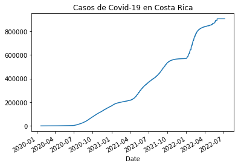
    


```python
casos_ni = df_rt_ni.set_index('Date')['Cases']
casos_ni.plot(title="Casos de Covid-19 en Nicaragua")
```


    <AxesSubplot:title={'center':'Casos de Covid-19 en Nicaragua'}, xlabel='Date'>


    
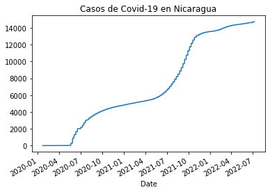
    


```python
casos_gt = df_rt_gt.set_index('Date')['Cases']
casos_gt.plot(title="Casos de Covid-19 en Guatemala")
```


    <AxesSubplot:title={'center':'Casos de Covid-19 en Guatemala'}, xlabel='Date'>


    
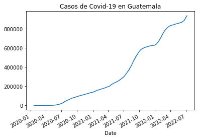
    


```python
casos_sv = df_rt_sv.set_index('Date')['Cases']
casos_sv.plot(title="Casos de Covid-19 en El Salvador")
```


    <AxesSubplot:title={'center':'Casos de Covid-19 en El Salvador'}, xlabel='Date'>


    
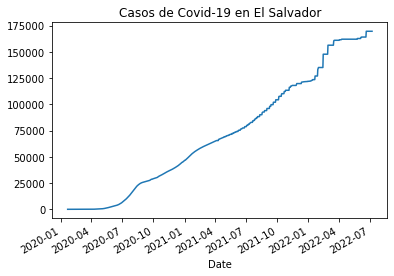
    


```python
casos_hn = df_rt_hn.set_index('Date')['Cases']
casos_hn.plot(title="Casos de Covid-19 en Honduras")
```


    <AxesSubplot:title={'center':'Casos de Covid-19 en Honduras'}, xlabel='Date'>


    
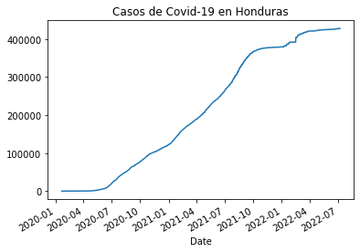
    


### Concatenación de todas las tablas

Voy a concatenar las **tablas de cada uno de los países** para una mejor visualización.


```python
casos_pa_cr_ni_gt_sv_hn = pd.concat([casos_pa,casos_cr,casos_ni,casos_gt,casos_sv,casos_hn],axis=1)
casos_pa_cr_ni_gt_sv_hn.columns= ['Panamá','Costa Rica', 'Nicaragua', 'Guatemala', 'El Salvador', 'Honduras']
casos_pa_cr_ni_gt_sv_hn
```


<div>
<style scoped>
    .dataframe tbody tr th:only-of-type {
        vertical-align: middle;
    }

    .dataframe tbody tr th {
        vertical-align: top;
    }

    .dataframe thead th {
        text-align: right;
    }
</style>
<table border="1" class="dataframe">
  <thead>
    <tr style="text-align: right;">
      <th></th>
      <th>Panamá</th>
      <th>Costa Rica</th>
      <th>Nicaragua</th>
      <th>Guatemala</th>
      <th>El Salvador</th>
      <th>Honduras</th>
    </tr>
    <tr>
      <th>Date</th>
      <th></th>
      <th></th>
      <th></th>
      <th></th>
      <th></th>
      <th></th>
    </tr>
  </thead>
  <tbody>
    <tr>
      <th>2020-01-22 00:00:00+00:00</th>
      <td>0</td>
      <td>0</td>
      <td>0</td>
      <td>0</td>
      <td>0</td>
      <td>0</td>
    </tr>
    <tr>
      <th>2020-01-23 00:00:00+00:00</th>
      <td>0</td>
      <td>0</td>
      <td>0</td>
      <td>0</td>
      <td>0</td>
      <td>0</td>
    </tr>
    <tr>
      <th>2020-01-24 00:00:00+00:00</th>
      <td>0</td>
      <td>0</td>
      <td>0</td>
      <td>0</td>
      <td>0</td>
      <td>0</td>
    </tr>
    <tr>
      <th>2020-01-25 00:00:00+00:00</th>
      <td>0</td>
      <td>0</td>
      <td>0</td>
      <td>0</td>
      <td>0</td>
      <td>0</td>
    </tr>
    <tr>
      <th>2020-01-26 00:00:00+00:00</th>
      <td>0</td>
      <td>0</td>
      <td>0</td>
      <td>0</td>
      <td>0</td>
      <td>0</td>
    </tr>
    <tr>
      <th>...</th>
      <td>...</td>
      <td>...</td>
      <td>...</td>
      <td>...</td>
      <td>...</td>
      <td>...</td>
    </tr>
    <tr>
      <th>2022-07-03 00:00:00+00:00</th>
      <td>925254</td>
      <td>904934</td>
      <td>14690</td>
      <td>920294</td>
      <td>169646</td>
      <td>427718</td>
    </tr>
    <tr>
      <th>2022-07-04 00:00:00+00:00</th>
      <td>925254</td>
      <td>904934</td>
      <td>14690</td>
      <td>921146</td>
      <td>169646</td>
      <td>427718</td>
    </tr>
    <tr>
      <th>2022-07-05 00:00:00+00:00</th>
      <td>925254</td>
      <td>904934</td>
      <td>14690</td>
      <td>922340</td>
      <td>169646</td>
      <td>427718</td>
    </tr>
    <tr>
      <th>2022-07-06 00:00:00+00:00</th>
      <td>925254</td>
      <td>904934</td>
      <td>14721</td>
      <td>927473</td>
      <td>169646</td>
      <td>427718</td>
    </tr>
    <tr>
      <th>2022-07-08 00:00:00+00:00</th>
      <td>925254</td>
      <td>904934</td>
      <td>14721</td>
      <td>933259</td>
      <td>169646</td>
      <td>427718</td>
    </tr>
  </tbody>
</table>
<p>898 rows × 6 columns</p>
</div>


### Gráfica de todos los países de Centroamérica

Luego de concatenar las tablas se procedió a **plotear** para ver la gráfica comparativa de todos los países antes vistos. 


#### Análisis

En la gráfica siguiente hay datos comparativos de los casos de covid-19 en los países centroamericanos. Podemos ver que en el caso de **Panamá**, el número va en aumento en una línea casi similar a **Panamá, Costa Rica y Guatemala**. 


```python
casos_pa_cr_ni_gt_sv_hn.plot(title="Comparativa Covid-19 en los países de Centroamérica")
```


    <AxesSubplot:title={'center':'Comparativa Covid-19 en los países de Centroamérica'}, xlabel='Date'>


    
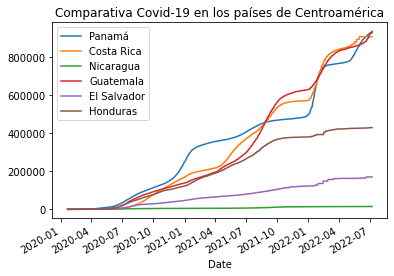
    

